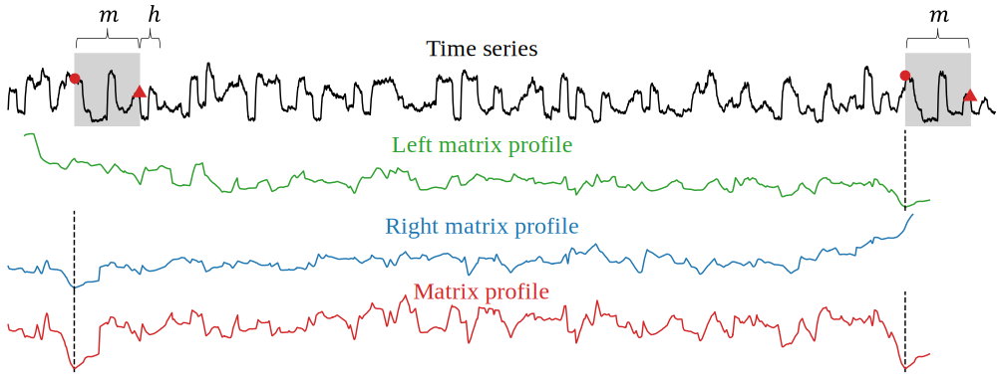

# Leveraging Nearest Neighbors for Time Series Forecasting with Matrix Profile


## Notifications

## Installation
```
    conda create -n mpmf python=3.10 pandas numpy matplotlib seaborn scikit-learn xgboost 
    conda activate mpmf
    conda install -c conda-forge stumpy
    conda deactivate
    conda env remove -n mpmf
```
- `mpmf` stands for **m**atrix-**p**rofile-**m**otif-**f**orecasting (i.e., the repository name).
- How to run the code? [Here!](results/README.md)

## Datasets
- Electricity [[sen2019think]](#sen2019think)
- Traffic [[sen2019think]](#sen2019think)
- PeMSD7 [[sen2019think]](#sen2019think)
- Exchange-Rate [[lai2018modeling]](#lai2018modeling)

## Project Structure
```
.
├── data
├── figures
├── GBRT_Univariate
├── environment.yml
├── python
│   ├── environment_information.ipynb
│   ├── evaluate_pemds7.ipynb
│   ├── GBRT_for_TSF
│   │   └── utils.py
│   ├── grid_search_*.py
│   ├── mpmf
│   │   └── utils.py
│   ├── run_grid_search.sh
│   ├── run_grid_*.sh
│   └── visualize_matrix_profile.ipynb
├── README.md
└── results
    └── README.md
```
- Please read [evaluate_pemds7.ipynb](python/evaluate_pemds7.ipynb) to understand the code. [grid_search_pemds7.py](python/grid_search_pemds7.py) is its derived code for the experiment.
- [run_grid_search.sh](python/run_grid_search.sh): For experiments. It runs the `grid_search_*_.py` sequentially.
- [results](results): Outputs of [run_grid_search.sh](python/run_grid_search.sh)
- [GBRT_Univariate/](GBRT_Univariate): The original code ([Commit 9b14dc9](https://github.com/Daniela-Shereen/GBRT-for-TSF/tree/9b14dc957cb2f33fc4a04566d9c140dc2b2a3014), accessed on 2025-12-23) from [[elsayed2021we]](#elsayed2021we) with little modifications such that it can be run in our environment and the result is reproducible by setting the random seed.
- [environment_information.ipynb](python/environment_information.ipynb): Check environment information.
- [environment.yml](environment.yml): My testing environment on my notebook (Apple M1 Pro chip, 16 GB memory).
  
## Corresponding Paper
### Data/Code for the Figures/Tables
- [[fig:visualize-matrix-profile]](python/visualize_matrix_profile.ipynb)

## References
Sorted by year
- <a id="lai2018modeling"></a>[lai2018modeling] "Modeling Long- and Short-Term Temporal Patterns with Deep Neural Networks" [(code)](https://github.com/fbadine/LSTNet)
- <a id="sen2019think"></a>[sen2019think] "Think Globally, Act Locally: A Deep Neural Network Approach to High-Dimensional Time Series Forecasting" [(code)](https://github.com/rajatsen91/deepglo)
- <a id="elsayed2021we"></a>[elsayed2021we] "Do We Really Need Deep Learning Models for Time Series Forecasting?" [(code)](https://github.com/Daniela-Shereen/GBRT-for-TSF)
  